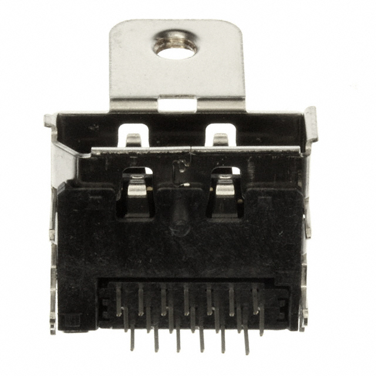

Display Port 1.1a - Receptacle - 20 Position, Through Hole, Right Angle, Horizontal

TE Connectivity - 2040210-1

Also known as;
 * A99344

[Manufacture Site](http://www.jae.com/z-en/product_en.cfm?l_code=en&series_code=DP1&product_number=DP1RD20JQ1R400)
[Digi-Key Purchase Link](http://www.digikey.com.au/product-detail/en/2040210-1/A99344-ND/1930791)

This part was created by [Ryan Karl](https://github.com/brightcloudy) and is
released under 
[CC-BY-SA 4.0 license](http://creativecommons.org/licenses/by-sa/4.0/).
